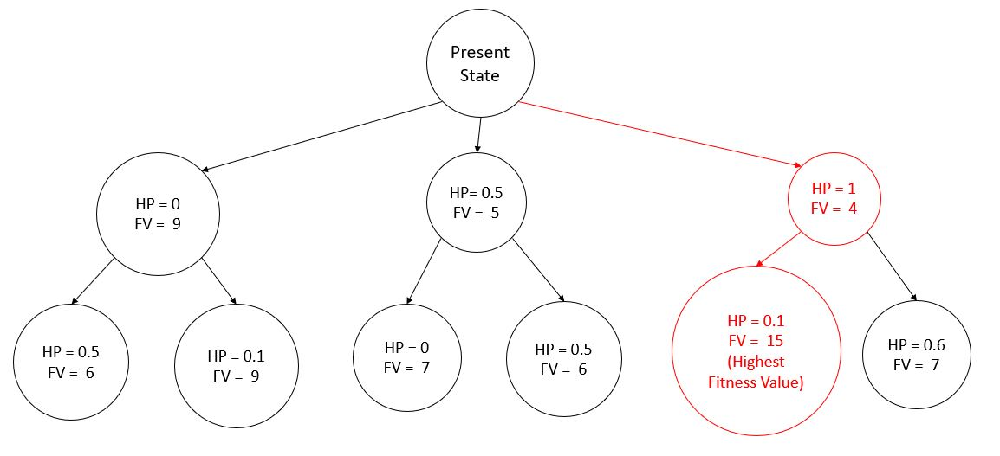
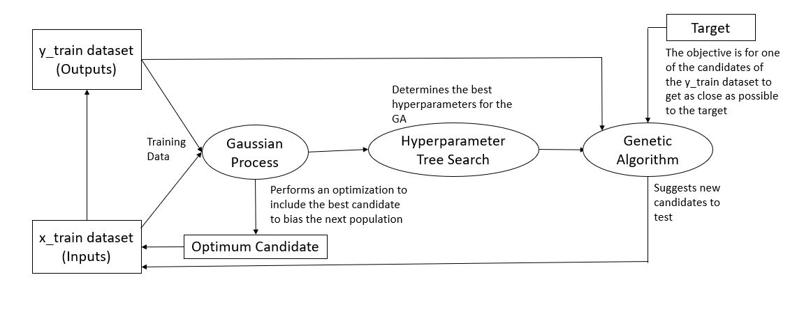

# REinforced-Automaton-Learning-REAL-Pipetting
[](https://travis-ci.com/REAL-Pipetting/REinforced-Automaton-Learning-REAL-Pipetting)
Cache-Control: no-cache
[](https://coveralls.io/github/REAL-Pipetting/REinforced-Automaton-Learning-REAL-Pipetting?branch=main)


This project integrates reinforcement learning with the open source pipetting robots from Opentrons (OT2) to guide future batched trials in high throughput experiments. We utilize two reinforcement learning algorithms:
1. Genetic Algorithm
2. Gaussian Process Batch Upper Confidence Bound (GP-BUCB)<sup>1</sup>


[1] Desautels, T; Krause, A.; Burdick, J. Parallelizing Exploration-Exploitation Tradeoffs in Gaussian Process Bandit Optimization. Journal of Machine Learning Research 15 (2014) 4053-4103.

### Genetic Algorithm
The Genetic algorithm (GA) is a technique based on natural selection. A number of parents is selected from the highest fitness individuals. Genes from these individuals are then randomly selected to form a new generation of samples. This new generation’s genes are randomly mutated and then the cycle repeats and parents are selected from the new generation. See the diagram below for an example of how a batch of the GA algorithm would work. In this case, there are two genes and the fitness of each sample is the sum of the genes. After the fitness calculation, new parents would be selected from the children. 


The hyperparameters associated with the GA are the mutation rate and number of parents. The higher the mutation rate, the more likely a gene is to mutate, adding exploration of the feature space. The number of parents is how many parents from a generation to crossover. The more parents selected the more variety of genes will be passed down to the next generation.

The two main limitations of Genetic Algorithms are the possibility of converging to a local optimum and taking many iterations to converge to an answer. In an attempt to mitigate these issues, we have used a Gaussian Process to assist our genetic algorithm. The first way in which this works is by helping to tune the
hyperparameter. The mutation rate controls how much the
 GA explores versus exploits and choosing it in a correct way can massively increase the efficiency of the algorithm. To do this, we have developed a tree search which runs the GA with different hyperparameter values and calculates which run 
returns the best result or fitness value (FV). The FV is calculated using the Gaussian Process which is simultaneously trained from data obtained from the experiment. A figure of the tree search is shown below. 



The figure above is an example of the hyperparameter tree search that occurs in every iteration of the genetic algorithm. In this tree, the best hyperparameter to use is 1, followed by 0.1, which 
is what the GA will use. It is important to note that the actual search is much larger than the one displayed, and because of this, one major problem
is that it can become inefficient due to the large number of hyperparameter permutations. To solve this issue, a separate GA  was applied to the tree search to optimize the fitness values, while changing the hyperparameters.
After a few iterations on the tree search are conducted, the best value is obtained and the hyperparameter to obtain that value is passed on to the genetic algorithm.

Another way the Gaussian Process is used to assist the GA is by including an optimized candidate in the next population. The effect of this is that it biases the GA into candidates which, according to the Gaussian Process, has a
 high fitness value. The GA searches in the vicinity of this optimum which in turn allows better data to train the Gaussian Process. A flowchart how all these algorithms work together is shown below.

   


### GP-BUCB
The Gaussian Process - Upper Confidence Bound algorithm discretizes features to develop a parameter space with number of dimensions equal to the number of features. At each point in the space holds an average reward and standard deviation. It models the reward function as a Gaussian Process. The GP-BUCB selects the sample with the highest upper bound (mean + std * beta^½)  where beta is a hyper parameter that affects how much to weight the standard deviation in the sample process. Higher beta means a higher priority is given to samples with higher uncertainty, encouraging the GP-BUCB to explore the space more. As it samples from the parameter space, the GP-BUCB updates the mean and uncertainty for every point in the parameter space using Gaussian Process Regression. Our implementation of the GP-BUCB uses [scikit-learn's implementation of GP Regression](https://scikit-learn.org/stable/modules/generated/sklearn.gaussian_process.GaussianProcessRegressor.html). 


In this implementation of GP-BUCB, the algorithm generates the first batch using a [Latin Hypercube Sampling](https://en.wikipedia.org/wiki/Latin_hypercube_sampling) method. This sampling method is biased towards exploring the sampled space. This gives the GPBUCB a even initial understanding of the parameter space. 


The diagram below shows the GP-BUCB solving a problem using two features and sampling three times per batch. The location in the parameter space marked with the black box is the location of the solution. The combination of features the GPBUCB chooses to sample each batch are marked green. In this case, the GP-BUCB is able to reach an exact solution, but that does not have to be the case. If given a problem with a solution not in the parameter space, it will converge to the best solution within the parameter space. 


There are additional operations depending on which implementation of the GP-BUCB you use.
All are found in ucb.py. 

GPBUCBv2 includes “hallucinated samples”. It is the same as the default GP-BUCB except during batch’s it will do GP Regression after every sample is selected. Since it can not get the true reward for a sample mid-batch, it “hallucinates” the rewards as the current expected reward (the mean). By doing this, it gives the GP-BUCB more confidence in the region around the sample encouraging the algorithm to explore more within a batch. After the batch is done, the hallucinated rewards are replaced with the true rewards.

GPBUCBv3 also uses hallucinated samples. Additionally, GPBUCBv3 will prune regions of the parameter space deemed unlikely to contain the best solution. The criteria it uses is if the best mean - standard deviation (i.e. a conservative estimate of the best possible reward) is higher than a points mean+standard deviation * beta^1/2 (i.e. a optimistic estimate of that points rewards) than that point is removed from the parameter space. By doing this, GPBUCBv3 is faster than GPBUCBv2, especially as more and more of the space is pruned.


Both the GA and GP-BUCB functions only return value features, and the only input they expect while learning is the reward associate with those combination of features. Therefore, any problem may be "hooked-up" to these algorithms as long as one as the user is able to provide the reward given a combination of features. 


### Installation
To install realpy:
1. Clone this repo
2. ```pip install /path/to/directory/with/this/readme/```

Or navigate to this directory in the terminal and ```pip install .```

Afterwards, you can ```import realpy``` for use in any python file.


### Future directions
Future optimizations to be made to the Batch GP BUCB agent:
1. Incorporation of input parameter constraints
2. Sequential Gaussian Process Regression
3. Lazy Variance Calculation
4. Incorporation of prior model
5. Parallel learners
